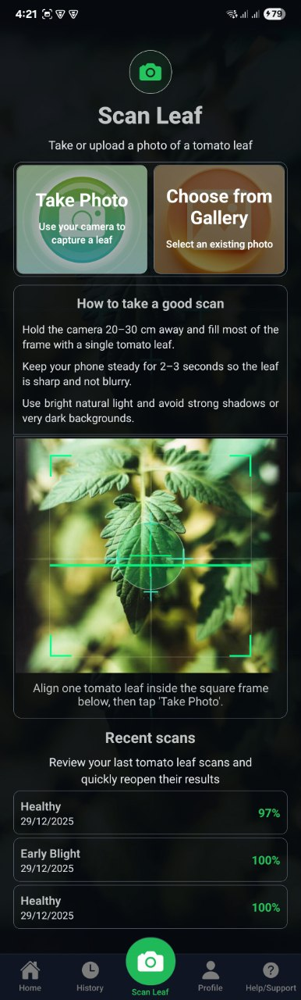
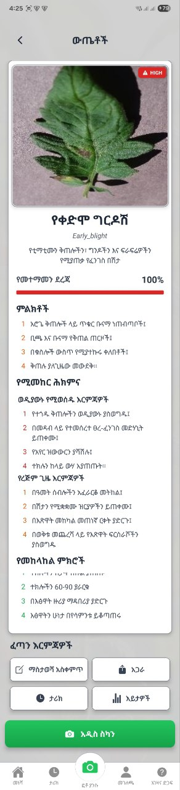
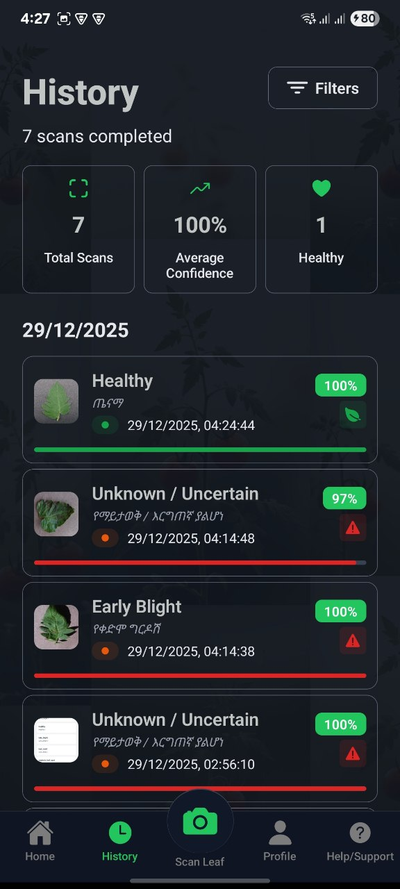
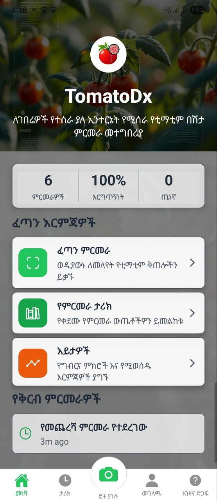
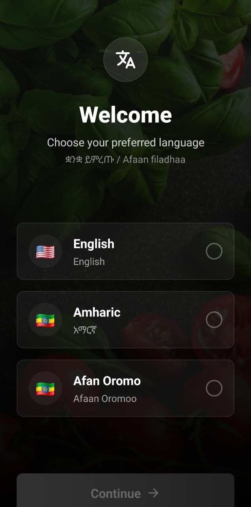

# TomatoDx

**Offline tomato disease diagnosis for smallholder farmers.**

TomatoDx is a cross-platform mobile app that helps farmers and gardeners detect tomato plant diseases quickly and accurately. Using on-device machine learning, the app analyzes leaf photos locally, no internet connection required, and returns a diagnosis with treatment guidance in the user's preferred language.

**Live demo:** [tomatodx.netlify.app](https://tomatodx.netlify.app/)

---

## Screenshots

<p align="center">
  
  
  
  
  
</p>

---

## Features

- **Instant leaf scanning** — Capture a photo with the camera or upload from the gallery.
- **On-device AI inference** — TensorFlow.js runs entirely on the phone; images never leave the device unless you choose to share them.
- **10 disease classes** — Detects common tomato diseases plus healthy-leaf classification.
- **Actionable results** — View confidence scores, severity levels, symptoms, and treatment advice for each diagnosis.
- **Scan history & insights** — Review past scans, track trends over time, and monitor crop health from the dashboard.
- **Multilingual support** — English, Amharic (አማርኛ), and Afaan Oromoo.
- **Ethiopian calendar** — Dates displayed using the Ethiopian calendar where applicable.
- **Privacy-first design** — All processing happens locally; optional sharing for research is entirely user-controlled.
- **Reminders** — Scheduled notifications to encourage regular crop checkups.
- **Dark & light themes** — Automatic theme switching based on system preference.

---

## Model Evaluation

The classifier was evaluated on a held-out test set of 15,253 images, separate from the training data, across all 10 disease classes plus an out-of-distribution "Unknown" class used to reject non-leaf or unrecognized inputs.

**Overall Accuracy:** 91.65%
**Macro F1 Score:** 0.8892
**Weighted F1 Score:** 0.9147

| Class                         | Precision | Recall | F1 Score |
| ----------------------------- | --------- | ------ | -------- |
| Tomato Yellow Leaf Curl Virus | 0.9958    | 0.9714 | 0.9835   |
| Bacterial Spot                | 0.9811    | 0.9788 | 0.9800   |
| Unknown                       | 0.9330    | 0.9984 | 0.9646   |
| Leaf Mold                     | 0.9803    | 0.8468 | 0.9087   |
| Spider Mites (Two-Spotted)    | 0.9517    | 0.8598 | 0.9034   |
| Healthy                       | 0.9258    | 0.8815 | 0.9031   |
| Late Blight                   | 0.8273    | 0.9417 | 0.8808   |
| Septoria Leaf Spot            | 0.8600    | 0.8876 | 0.8736   |
| Target Spot                   | 0.8202    | 0.7987 | 0.8093   |
| Early Blight                  | 0.8051    | 0.7833 | 0.7941   |
| Tomato Mosaic Virus           | 0.9290    | 0.6719 | 0.7798   |

Full methodology, confusion matrix, and the evaluation script are documented separately and available on request.

---

## Known Limitations

- **Not yet field-tested.** All evaluation was performed on curated dataset images. Real-world performance on farmer-captured photos, taken with varied lighting, angles, and camera quality, has not yet been measured.
- **Weakest on visually similar diseases.** Tomato Mosaic Virus (F1 0.78) and Early Blight (F1 0.79) show reduced recall, largely confused with Early Blight and Late Blight respectively, conditions that are visually similar even to trained observers.
- **Class imbalance in training data.** The Unknown category was trained with substantially more examples than individual disease classes, which biases the model toward Unknown under ambiguous or out-of-distribution input. This is mitigated but not fully resolved.
- **No confidence calibration study.** Reported confidence scores have not been separately validated for calibration accuracy.

---

## Supported Conditions

| Condition                  | Severity |
| -------------------------- | -------- |
| Early Blight               | High     |
| Late Blight                | Critical |
| Leaf Mold                  | Medium   |
| Septoria Leaf Spot         | Medium   |
| Tomato Yellow Leaf Curl    | Medium   |
| Target Spot                | Medium   |
| Spider Mites (Two-Spotted) | Medium   |
| Tomato Mosaic Virus        | Medium   |
| Bacterial Spot             | Medium   |
| Healthy                    | —        |

---

## Tech Stack

| Layer     | Technology                                                                          |
| --------- | ----------------------------------------------------------------------------------- |
| Framework | [Expo](https://expo.dev) ~54, [React Native](https://reactnative.dev) 0.81          |
| Routing   | [Expo Router](https://docs.expo.dev/router/introduction/) (file-based)              |
| Language  | TypeScript                                                                          |
| ML        | [TensorFlow.js](https://www.tensorflow.org/js) + `@tensorflow/tfjs-react-native`    |
| Database  | [react-native-quick-sqlite](https://github.com/ospfranco/react-native-quick-sqlite) |
| i18n      | [i18next](https://www.i18next.com/) / react-i18next                                 |
| UI        | React Native Reanimated, Expo Linear Gradient, Expo Vector Icons                    |

---

## Getting Started

### Prerequisites

- [Node.js](https://nodejs.org/) 18 or later
- npm (included with Node.js)
- [Expo CLI](https://docs.expo.dev/more/expo-cli/) (via `npx`)
- For device builds: [Android Studio](https://developer.android.com/studio) and/or [Xcode](https://developer.apple.com/xcode/) (macOS only)

### Installation

```bash
git clone <repository-url>
cd TomatoDx
npm install
```

### Running the App

```bash
# Start the Expo development server
npm start

# Run on a specific platform
npm run android
npm run ios
npm run web
```

After starting the dev server, open the app in:

- **Expo Go** — Quick testing on a physical device
- **Android emulator** or **iOS simulator** — Full native experience
- **Development build** — Required for full camera and ML capabilities in production-like environments

---

## Project Structure

```
TomatoDx/
├── app/                    # Expo Router screens
│   ├── tomatodx/           # Main app flow (home, scan, results, history, settings)
│   ├── onboarding.tsx      # First-launch walkthrough
│   └── language-selection.tsx
├── src/
│   ├── ml/                 # Model loading, preprocessing, and inference
│   ├── db/                 # SQLite schema, repository, and seed data
│   ├── i18n/               # Translation files (en, am, oro)
│   ├── data/                # Disease metadata
│   ├── components/         # Shared UI components
│   ├── contexts/           # Theme and toast providers
│   └── utils/              # Calendar, sharing, notifications, animations
├── assets/
│   ├── models/tfjs/         # Bundled TensorFlow.js model and weights
│   └── images/               # App icons, backgrounds, and UI assets
└── components/               # Global themed components
```

---

## How It Works

1. **Capture** — The user photographs a tomato leaf using the in-app camera or selects an image from the gallery.
2. **Preprocess** — The image is resized and converted to a tensor suitable for the model (224x224 input, normalized to [-1, 1] for MobileNetV2).
3. **Infer** — The bundled TensorFlow.js model runs inference on-device and returns class probabilities.
4. **Diagnose** — The top prediction is mapped to a disease profile with symptoms, severity, and treatment advice.
5. **Store** — Results are saved locally in SQLite for history, analytics, and follow-up.

---

## Available Scripts

| Command           | Description                       |
| ----------------- | --------------------------------- |
| `npm start`       | Start the Expo development server |
| `npm run android` | Build and run on Android          |
| `npm run ios`     | Build and run on iOS              |
| `npm run web`     | Start the web development server  |
| `npm run lint`    | Run ESLint                        |

---

## Privacy

TomatoDx processes all images locally on your device. Photos are not uploaded to any server. Scan history is stored in a local SQLite database on the device. Sharing results is optional and initiated only by the user.

---

## Disclaimer

TomatoDx is intended as a decision-support tool for farmers and gardeners. It does not replace professional agronomic advice or laboratory diagnosis. Always consult local agricultural extension services for critical crop health decisions.

---

## License

MIT License. See [LICENSE](LICENSE) for details.

---

## Version

Current release: **1.0.0**
